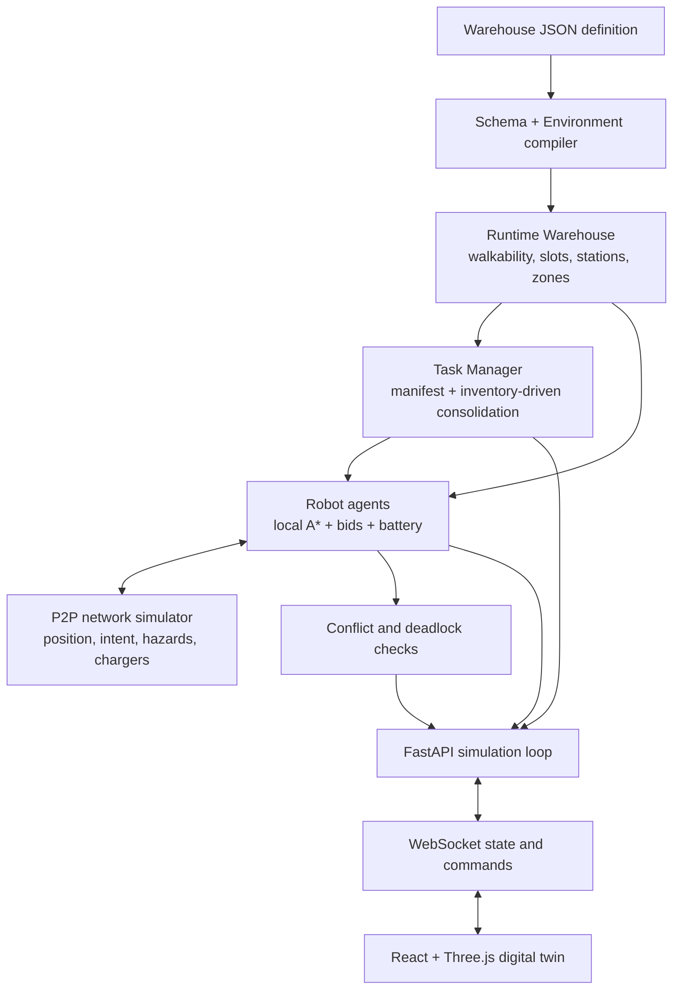

# Fleet in Motion — Decentralized AMR Fleet Coordination Digital Twin

<div align="center">


**SIH26123 — Edge-AI Based Distributed Fleet Coordination for Autonomous Mobile Robots in Smart Warehouses**

A data-driven warehouse simulator where autonomous mobile robots plan locally, coordinate through a simulated peer-to-peer mesh, allocate work through bidding, avoid traffic conflicts, recover from selected disruptions, handle cartons, manage battery charging, and stream their state to an interactive 3D digital twin.

</div>

---

## 1. What this repository is

Fleet in Motion is a **simulation and validation project** for decentralized multi-robot warehouse coordination. It contains:

- a Python/FastAPI simulation backend;
- autonomous robot agents with local A* planning;
- simulated P2P position, intent, hazard, and charger coordination;
- contract-net-style task allocation using robot-local bids;
- vertex/swap conflict prevention and deadlock recovery;
- a declarative warehouse schema and environment compiler;
- three different warehouse environments using the same robot intelligence;
- inventory-driven dynamic rack consolidation;
- battery, charging, barriers, and Wi-Fi partition drills;
- a React/Three.js operational digital twin;
- deterministic regression and benchmark tooling.

The main architectural test is:

> **Different warehouse data → same environment engine → same robot intelligence → working simulation and digital twin.**

This is currently a **software simulation**. It is not a ROS2 driver, a physical AMR controller, a certified safety system, or proof of production readiness.

---

## 2. Current implementation status

### Implemented

- Three validated warehouse definitions: 20×20, 28×16, and 36×24.
- Warehouse-independent `Robot`, A*, P2P, auction, collision, deadlock, battery, and charging logic.
- Static putaway demonstrations and dynamic rack consolidation.
- Deterministic inventory selection, existing bid assignment, completion, cancellation and uncollected-task reauction.
- Temporary aisle barriers and dynamic replanning.
- Simulated radio partitions with local sensing fallback and bidirectional state reconciliation.
- Before-pickup robot failure reauction and carrying failure with adjacent physical cargo recovery.
- Addressable rack slots with reservation, storage, pickup, and physical carton ownership.
- Compiler checks for connectivity, station access, rack access, chargers, spawns, and visual/navigation footprint agreement.
- WebSocket telemetry and operator commands.
- Interactive 3D visualization, camera modes, route/P2P overlays, robot inspection, and event/metrics panels.
- Automated backend, frontend, warehouse, presentation, and complete-episode tests.

### Deliberately not implemented yet

- Mechanical repair/towing and failures during in-progress lift/place/handoff dwell.
- General station outage and charging-station outage policies.
- Validated 5/10/25-robot scalability results.
- A general CAD, occupancy-map, or arbitrary 3D-model importer.
- ROS2/Nav2 adapters or commands to physical robots.
- Production safety certification or real sensor integration.

See [PHASE7_RESILIENCE.md](./PHASE7_RESILIENCE.md) for failure/recovery and reconciliation, [PHASE6_DYNAMIC_TASKS.md](./PHASE6_DYNAMIC_TASKS.md) for the consolidation boundary and [PHASE5_WAREHOUSE3.md](./PHASE5_WAREHOUSE3.md) for the Warehouse #3 validation history.

---

## 3. How the system works



### Important separation of responsibilities

| Layer | Owns | Must not own |
| --- | --- | --- |
| Warehouse definition | Dimensions, grid, stations, zones, racks, chargers, spawn points, physical footprints | Robot-specific algorithms |
| Environment compiler | Validation and conversion into a runtime warehouse | Presentation-only special cases |
| Runtime `Warehouse` | Walkability, barriers, occupancy, semantic resolution, rack/table state | UI state |
| `Robot` | Local path planning, intent, yielding, battery and charger behavior | Warehouse-ID branches |
| `TaskManager` | Task lifecycle, slot reservations, priority order and bid allocation | 3D rendering |
| FastAPI loop | Time progression, command dispatch, state streaming and metrics | Robot route decisions |
| React digital twin | Visualization and operator interaction | Authoritative simulation state |

Do not add logic such as `if warehouse_id == "warehouse_3"` to `robot.py`. If a warehouse needs different geometry or semantics, express it in the warehouse definition or improve the shared environment abstraction.

---

## 4. Core simulation behavior

### Robot-local navigation

Each robot calls the shared A* implementation in `backend/pathfinding.py` using:

- its current position;
- the active warehouse's walkability map;
- temporary barriers;
- sensed robot occupancy;
- current peer intent information.

A route is a sequence of 4-connected grid cells. One grid cell represents one meter by default.

### P2P coordination

`backend/p2p.py` models a peer inbox for every robot. Agents broadcast state to other connected peers. Supported traffic includes:

- `pos`: current cell;
- `intent`: near-term planned path and remaining distance;
- `blocked`: a newly discovered closed aisle;
- `result`: task-auction result;
- `charger_claim` / `charger_release`: exclusive charging-pad negotiation.

A radio-partitioned robot stops sending and receiving mesh traffic. Collision behavior then falls back to locally sensed occupancy within `SENSOR_RANGE`. This models the behavior; it is not a real radio or LiDAR integration.

### Conflict handling

The simulator protects against:

- **vertex conflict**: two robots ending a tick in the same cell;
- **swap conflict**: two robots exchanging cells during the same tick;
- **lookahead conflict**: intersecting near-term intents;
- **wait-for deadlock**: a cycle such as A waiting for B, B for C, and C for A.

Deadlock detection builds a wait-for graph and uses DFS-style cycle detection. Resolution chooses a deterministic yielding robot, backs it into an available neighboring cell, and replans.

### Task allocation

The task manager asks idle, available robots to calculate bids. A bid combines distance and battery state. The highest valid bid wins with deterministic robot-ID tie-breaking.

Pending tasks are ordered by:

1. priority, highest first;
2. creation tick;
3. task ID.

### Carton ownership invariant

A carton must exist in exactly one place:

1. on its source table or rack slot;
2. in a robot's handling/carrying state;
3. at its destination rack slot or station.

Rack destinations are reserved before assignment. The source becomes empty when pickup handling begins. A rack destination becomes `stored` only after delivery finishes.

### Battery and charging

Robots drain battery while moving or idling. Below `BATTERY_LOW_THRESHOLD`, an eligible robot negotiates a charging pad over the mesh. Uncollected work can return to the auction. A robot already carrying a carton finishes that delivery before charging. At the end of the demonstration, the fleet books distinct pads, charges, and parks.

---

## 5. Included warehouses

| ID | Name | Size | Purpose |
| --- | --- | ---: | --- |
| `warehouse_1` | Standard Demonstration Warehouse | 20×20 | Original compact benchmark and demonstration floor |
| `warehouse_2` | Isometric Smart Operations Hub | 28×16 | Fulfillment/distribution center with receiving, dispatch, rack quadrants, QA, packing, charging and restricted areas |
| `warehouse_3` | Automated Cross-Dock & ASRS Campus | 36×24 | Opposing docks, storage banks, sortation, ASRS core, charging court, picking, packing, maintenance and reverse logistics |

All three compile into the same runtime `Warehouse` class and use the same `Robot`, `TaskManager`, pathfinding, P2P, collision, and deadlock code.

Warehouse #3 also uses a physical-clearance contract: custom solid machinery declares navigation footprints, and the compiler rejects any footprint that remains walkable.

---

## 6. Quick start

### Prerequisites

- Python 3.10 or newer;
- Node.js 20 or newer;
- npm;
- a browser with WebGL enabled.

Clone and enter the repository:

```bash
git clone https://github.com/Farhan0629/Fleet-In-Motion.git
cd Fleet-In-Motion
```

### Terminal 1 — backend

#### Windows PowerShell

```powershell
cd backend
python -m pip install -r requirements.txt
python -m uvicorn main:app --host 0.0.0.0 --port 8000 --reload
```

#### macOS/Linux

```bash
cd backend
python3 -m pip install -r requirements.txt
python3 -m uvicorn main:app --host 0.0.0.0 --port 8000 --reload
```

Expected backend URLs:

- status: `http://localhost:8000/api/status`
- API documentation: `http://localhost:8000/docs`
- WebSocket: `ws://localhost:8000/ws`

### Terminal 2 — frontend

```bash
cd frontend
npm ci
npm run dev
```

Open `http://localhost:5173`.

The connection badge should change to **Connected · Ready**.

### Frontend WebSocket configuration

During local Vite development, the client automatically connects to port `8000`. To use another backend:

```bash
# frontend/.env
VITE_WS_URL=ws://your-backend-host:8000/ws
```

Use `wss://` when the frontend is served over HTTPS.

### Windows `npm ci` EPERM error

If Windows reports that `lightningcss.win32-x64-msvc.node` cannot be unlinked, a Node/Vite process or OneDrive/antivirus scanner is holding it open.

1. Stop every running frontend terminal with `Ctrl+C`.
2. Close editors or terminals using `frontend/node_modules`.
3. From `frontend`, run:

```powershell
Remove-Item -Recurse -Force node_modules
npm cache verify
npm ci
npm run dev
```

Running the repository outside a continuously synchronized OneDrive folder can also prevent file-lock issues.

---

## 7. Using the digital twin

### Basic demonstration

1. Select a warehouse under **Facility topology**.
2. Choose a playback speed.
3. Click **Start demonstration**.
4. Select a robot to inspect its status, cargo, battery, task and next destination.
5. Use **Follow selected**, **Robot's POV**, **Top-down**, or **Manual orbit**.
6. Enable route and P2P overlays when debugging coordination.
7. Observe each carton move from a staged table to its reserved rack slot.
8. After the final putaway, observe charger negotiation and fleet parking.

### Disruption drills

- **Barrier**: pause, enable barrier placement, draw on free aisle cells, then resume.
- **Auto-block route**: asks the server to select a relevant route cell.
- **Wi-Fi dead zone**: partition or reconnect one robot's simulated mesh radio.
- **Force high battery**: restore a selected robot to full charge for demonstration purposes.
- **Unavailable robot**: remove an idle or pre-pickup unit from service; its uncollected work returns to the auction.

Barriers can only be added to free, unoccupied aisle cells while the floor is stopped or paused.

### Dynamic rack consolidation

Select a warehouse while stopped, click **Prepare inventory**, then **Fill Empty Rack**.
Setup loads explicit existing cartons from warehouse data and keeps its designated
rack completely empty. Activation inspects live stored inventory, ranks feasible
rack-to-rack moves by A* route cost, reserves unique source/destination slots, and
feeds relocation tasks into the existing fleet auction. Cartons physically leave
source slots, travel with their winning robots and settle in target slots.

The panel shows target capacity, source availability, generated/pending/active/
completed tasks, progress, robot ownership and collision/deadlock counts. Missing
or full targets, unavailable routes, insufficient inventory, cancellation and robot
unavailability have explicit mission states. Timeout retains inventory and allows
**Resume retained mission**. Cancellation/reassignment are prohibited after pickup.

The original **Start demonstration** remains the Phase 1–5 table putaway scenario.
See [PHASE6_DYNAMIC_TASKS.md](./PHASE6_DYNAMIC_TASKS.md) for the data contract,
selection policy, safety rules and verification results.

### Fleet resilience and recovery

During consolidation, select a robot in **Fleet resilience** and use the valid
**Simulate Robot Failure**, **Simulate Communication Loss**, **Restore Robot** or
**Restore Communication** controls. Pause or use 0.25x speed for a precise drill.
Before-pickup failure releases/revalidates original claims and reauctions the same
task. Carrying failure preserves cargo on the failed unit and reserves the original
destination until a winning robot arrives beside it and performs an animated
physical handoff. The existing auction, A*, P2P, rack placement and safety logic
remain in use. In-progress transfers cannot be failed or remotely cancelled.

Communication loss invalidates stale peer predictions and enters local sensing
mode. Restoration exchanges current position, task, cargo ownership, destination
and charger snapshots in both directions; old connection packets cannot resurrect
old state. The existing Wi-Fi drill uses this same mechanism. Failed robots can be
restored only after cargo/task release, at their unchanged actual coordinates.

Live metrics count real failures, successful recoveries, recovered cargo, reauction
assignments, link losses/reconciliations and failure-to-delivery ticks. See
[PHASE7_RESILIENCE.md](./PHASE7_RESILIENCE.md) for states, tests and limitations.

---

## 8. Warehouse definition format

Warehouse files live in `backend/warehouses/` and are validated by Pydantic models in `backend/warehouse_schema.py`.

### Grid symbols

| Symbol | Meaning |
| --- | --- |
| `.` | walkable floor |
| `#` | shelf/rack cell; not walkable and converted into addressable rack slots when accessible |
| `W` | wall or solid machinery footprint; not walkable |
| `P` | pickup/staging service cell |
| `D` | drop-off/staging service cell |
| `C` | charging pad |

Every layout row must exactly match `dimensions.width`, and the number of rows must match `dimensions.height`.

### Main definition sections

```json
{
  "id": "warehouse_example",
  "name": "Example Warehouse",
  "version": "1.0.0",
  "dimensions": { "width": 20, "height": 12, "cell_size": 1.0 },
  "theme": "bright_industrial",
  "layout": ["..."],
  "operational_settings": {
    "default_num_robots": 3,
    "robot_starts": [[1, 1], [1, 5], [1, 9]],
    "target_islands": [0]
  },
  "stations": [],
  "chargers": [],
  "zones": [],
  "markings": [],
  "exterior_assets": []
}
```

### Stations

A station defines a semantic code, grid cell, service side, and type:

```json
{
  "id": 0,
  "code": "IN-01",
  "cell": [3, 1],
  "side": "north",
  "station_type": "pickup"
}
```

`side` is important. The runtime and renderer use it so the table fixture is placed near the correct edge while the service cell remains clear for the robot.

### Semantic zones

Zones let tasks refer to concepts such as `packing_area`, `rack_a`, or `dispatch_zone`. Storage zones resolve to real rack slots. Other zones resolve to a walkable service cell near the zone center.

### Solid visual footprints

If a rendered machine occupies floor cells, declare them as `W` in the layout and describe the same bounds in zone metadata:

```json
"metadata": {
  "navigation_footprint": [15, 8, 20, 13]
}
```

Multipart equipment can use:

```json
"metadata": {
  "navigation_footprints": [
    [11, 3, 12, 6],
    [23, 3, 24, 6],
    [13, 6, 22, 6]
  ]
}
```

The compiler fails if a declared solid footprint overlaps a walkable cell. This prevents the digital twin from showing robots driving through machinery.

### Compiler checks

`EnvironmentEngine` verifies:

- schema validity and dimensions;
- walkable connectivity;
- graph diameter;
- station accessibility;
- rack-slot access;
- charger accessibility and capacity;
- robot spawn validity;
- agreement between solid visual footprints and navigation.

Compile a definition directly:

```bash
cd backend
python -c "from environment_engine import EnvironmentEngine; _, report = EnvironmentEngine.compile_file('warehouses/warehouse_3.json'); print(report.summary()); raise SystemExit(0 if report.is_valid else 1)"
```

### Adding Warehouse #4 safely

1. Copy an existing JSON definition.
2. Give it a unique lowercase `id` and correct dimensions.
3. Design the grid first; keep all required stations and chargers connected.
4. Add semantic stations and zones.
5. Mark every solid rendered footprint with `W` and footprint metadata.
6. Set valid robot starts and enough charging pads.
7. Compile the definition and fix every error.
8. Add warehouse-specific topology tests, not warehouse-specific robot behavior.
9. Add the warehouse to the `WAREHOUSES` selector in `frontend/src/dashboard/Controls.jsx`.
10. Run the complete test suite and a full episode before committing.

---

## 9. Backend interfaces

### REST endpoints

| Method | Endpoint | Purpose |
| --- | --- | --- |
| `GET` | `/api/status` | Service health and version |
| `GET` | `/api/warehouse` | Active compiled warehouse state |
| `GET` | `/api/warehouses` | Available JSON definitions |
| `POST` | `/api/warehouses/{id}/select` | Switch the active warehouse and reset the simulation |
| `GET` | `/api/metrics` | Current metrics snapshot |
| `GET` | `/docs` | FastAPI-generated API documentation |

### WebSocket

Connect to `/ws`. The server first sends an `init` frame, then `state_update` frames containing:

- tick and simulation status;
- robot state, path, battery, task and handling state;
- warehouse grid, tables, slots, zones and barriers;
- pending, active, completed, cancelled and failed tasks;
- metrics, recent P2P messages and event log;
- network partition state.

### WebSocket commands

Send JSON objects with an `action` field:

| Action | Important fields | Purpose |
| --- | --- | --- |
| `start` | — | Reset and start the demonstration |
| `pause` | — | Toggle pause/resume |
| `speed` | `value` | Set speed from 0.1 to 4 |
| `switch_warehouse` | `warehouse_id` | Load another definition |
| `block_aisle` | optional `x`, `y` | Block a cell or auto-select a route cell |
| `unblock_aisle` | `x`, `y` | Remove one barrier |
| `clear_blocks` | — | Remove all temporary barriers |
| `toggle_partition` | `robot_id` | Existing Wi-Fi loss/reconciliation toggle |
| `simulate_robot_failure` | `robot_id` | Fail an active pre-pickup or carrying robot |
| `restore_robot` | `robot_id` | Restore a failed robot after cargo/task release |
| `simulate_communication_loss` | `robot_id` | Enter degraded local sensing mode |
| `restore_communication` | `robot_id` | Exchange fresh state and reconcile custody |
| `boost_battery` | `robot_id` | Set one robot to full charge |
| `prepare_consolidation` | — | Explicitly load warehouse-defined stored inventory while stopped |
| `fill_empty_rack` | — | Inspect inventory and start rack consolidation |
| `resume_consolidation` | — | Continue retained work after timeout |
| `cancel_task` | `task_id` | Cancel eligible work |
| `reassign_task` | `task_id` | Return an uncollected assignment to auction |
| `set_robot_available` | `robot_id`, `available`, optional `reason` | Remove/return a robot from service |
| `run_baseline` | — | Start the built-in baseline comparison |

Invalid commands return a `command_error` frame.

---

## 10. Repository structure

```text
Fleet-In-Motion/
├── backend/
│   ├── main.py                    FastAPI app, simulation loop, REST and WebSocket commands
│   ├── robot.py                   Warehouse-independent autonomous robot agent
│   ├── presentation_robot.py      Handling dwell used by the live digital twin
│   ├── pathfinding.py             Local grid A*
│   ├── p2p.py                     Simulated peer inboxes and network partitions
│   ├── collision.py               Vertex/swap auditing and wait-for deadlock resolution
│   ├── task_manager.py            Static manifest and consolidation task lifecycle
│   ├── warehouse_schema.py        Pydantic warehouse definition models
│   ├── environment_engine.py      Compiler, topology checks and diagnostics
│   ├── warehouse.py               Runtime grid, semantics, slots, inventory and barriers
│   ├── metrics.py / events.py     Telemetry collectors
│   ├── baseline.py                Stop-and-wait comparison controller
│   ├── smoke_demo.py              Headless putaway/charging invariant replay
│   ├── warehouses/                Warehouse JSON definitions and JSON Schema
│   └── test_*.py                  Backend and complete-episode regression tests
├── frontend/
│   ├── src/components/            Three.js scene, robots, warehouse, cargo and overlays
│   ├── src/dashboard/             Controls, task queue, robot inspector, metrics and events
│   ├── src/utils/                 Presentation math, state derivation and socket client
│   ├── src/store.js               Zustand application state
│   ├── src/websocket.js           Shared reconnecting WebSocket integration
│   ├── package.json               Frontend scripts and dependencies
│   └── vite.config.js             Vite/Tailwind setup and local WebSocket proxy
├── PHASE5_WAREHOUSE3.md           WH3 topology, visual and validation record
├── PHASE6_DYNAMIC_TASKS.md        Rack consolidation behavior and limitations
├── PUTAWAY_ROUND.md               Carton/storage workflow details
├── BARRIER_NAVIGATION.md          Barrier and rerouting behavior
├── CHANGES.md                     Development history and measured results
├── Dockerfile                     Production multi-stage build
└── render.yaml                    Render deployment definition
```

---

## 11. Configuration

Shared simulation defaults are in `backend/config.py`. Warehouse dimensions, starts, fleet size, target rack islands, and chargers should normally come from warehouse JSON.

| Setting | Current default | Meaning |
| --- | ---: | --- |
| `TICK_RATE` | `10` | Simulation ticks per second |
| `MAX_TICKS` | `2000` | Episode timeout |
| `LOOKAHEAD_WINDOW` | `5` | Planned cells included in intent broadcasts |
| `SENSOR_RANGE` | `5` | Simulated local occupancy sensing range |
| `BATTERY_MAX` | `100` | Maximum charge |
| `BATTERY_DRAIN_PER_MOVE` | `0.5` | Charge used per movement tick |
| `BATTERY_DRAIN_IDLE` | `0.1` | Charge used per non-movement tick |
| `BATTERY_LOW_THRESHOLD` | `50` | Charging detour threshold |
| `BATTERY_CHARGE_PER_TICK` | `5` | Charge recovered on a pad |
| `STORAGE_FLOW_ENABLED` | `True` | Use table-to-rack putaway for the web demonstration |
| `END_OF_ROUND_CHARGE` | `True` | Park and charge after the mission |

Change these carefully and rerun all tests. Benchmark results are only comparable when scenario and configuration are unchanged.

---

## 12. Testing and validation

### Complete backend suite

```bash
cd backend
pip install -r requirements-dev.txt
python -m unittest discover -s . -p "test_*.py"
```

The suite covers warehouse compilation, WH1/WH2/WH3 topology, A* rack access, barriers, dynamic tasks, handling contracts, station orientation, collision invariants, and deterministic episodes.

### Headless putaway and charging replay

```bash
cd backend
python smoke_demo.py
```

This checks:

- exactly one physical location per carton;
- no duplicated or missing cargo;
- tables empty once and do not refill;
- stored cartons remain stored;
- no collisions or charger double-booking;
- all robots eventually park on distinct pads.

### Coordination benchmark

```bash
cd backend
python test_simulation.py
```

The benchmark compares the decentralized fleet with stop-and-wait variants over deterministic episodes. It prints timeouts, same-cell conflicts, swap conflicts, completion time and sensitivity to backoff thresholds. Treat its exit status and full output as the result; do not copy only favorable numbers.

### Frontend tests and build

```bash
cd frontend
npm ci
npm test
npm run build
```

Frontend tests cover motion interpolation, heading conversion, cargo ownership, rack placement, station clearance, mission summaries, WebSocket behavior and alert presentation.

### Minimum verification before merging

```bash
cd backend
python -m unittest discover -s . -p "test_*.py"
python smoke_demo.py

cd ../frontend
npm test
npm run build
```

For geometry changes, also run the application and inspect every camera mode during a complete episode. A passing navigation test does not by itself prove that rendered geometry is correctly aligned.

---

## 13. Safe extension patterns

### Add a robot coordination rule

1. Confirm the behavior belongs to every warehouse.
2. Add it to `robot.py` or a shared helper, never to warehouse JSON.
3. Base decisions on runtime interfaces such as `is_walkable`, semantic endpoints, occupancy and P2P state.
4. Add deterministic tests for both the desired behavior and collision invariants.
5. Run episodes in all three warehouses.

### Add a new task type

1. Represent source and destination using warehouse-owned slot/station/zone IDs.
2. Resolve real shelf cells and access faces through the runtime `Warehouse`.
3. Preserve carton ownership and rack reservation rules.
4. Extend `Task.as_payload` and `_serialize` only with warehouse-independent fields.
5. Add lifecycle tests for inventory conservation, cancellation, reauction and robot availability.

### Add a visual machine

1. Add semantic metadata to the warehouse definition.
2. Mark its occupied grid cells as `W` or `#`.
3. Declare `navigation_footprint` or `navigation_footprints`.
4. Derive rendering position and size from those bounds.
5. Add compiler and complete-route tests.
6. Inspect the rendered model at ground level; do not rely only on overview screenshots.

### Preserve benchmark history

Do not overwrite old results. Record:

- commit hash;
- warehouse and configuration;
- seed or deterministic scenario;
- completion/timeouts;
- collision and deadlock counters;
- any changed assumptions.

---

## 14. Docker deployment

Build and run the combined frontend/backend image:

```bash
docker build -t fleet-in-motion .
docker run --rm -p 8000:8000 fleet-in-motion
```

Open `http://localhost:8000`. The Docker build compiles the frontend and lets FastAPI serve the generated static assets and WebSocket endpoint from the same origin.

`render.yaml` contains a Render deployment definition with `/api/status` as the health check.

---

## 15. Known limitations

- Coordination is simulated in one Python process; P2P inboxes model direct communication but are not separate physical edge computers.
- Movement is a discrete 2D grid model; the 3D scene interpolates between cells for presentation.
- Local sensing uses simulated occupancy, not real LiDAR data.
- Dynamic obstacles are operator-created grid barriers, not perception-generated obstacles.
- Robot dynamics, acceleration, wheel slip, localization error and payload mass are not modeled.
- Recovery requires a reachable adjacent handoff position and the original destination reservation; failures during a physical transfer are rejected.
- The frontend warehouse selector is currently a small explicit list and must be updated when adding another JSON definition.
- Large-fleet scaling claims have not yet been validated.
- ROS2, Nav2 and physical AMR adapters are future work.

These limitations are intentional and should remain explicit in demos, reports and future contributions.

---

## 16. Roadmap

The planned direction after the current warehouse and dynamic-task foundation is:

1. station-outage resilience beyond the completed robot/network recovery drills;
2. configurable fleet-size scalability tests;
3. automated warehouse × fleet × task × failure benchmarks;
4. richer operational inspection and replay in the digital twin;
5. validated external warehouse import/conversion;
6. simulation and ROS2 robot-adapter interfaces;
7. simulation-to-real architecture and final cross-scenario validation.

Each capability should be described as implemented only after code, tests, measured results, documentation, and a committed checkpoint exist.

---

## 17. Contributing

Before changing code:

1. inspect the current implementation and existing tests;
2. check `git status` and preserve unrelated work;
3. identify whether the change belongs to warehouse data, environment logic, robot intelligence, task lifecycle, server orchestration, or presentation;
4. make the smallest reusable change;
5. add regression coverage;
6. run backend tests, frontend tests, a production build, and a complete relevant simulation;
7. document changed behavior and known limitations;
8. commit with a focused message; do not force-push shared branches.

Useful commit prefixes:

- `fix:` bug correction;
- `feat:` implemented capability;
- `test:` test-only work;
- `docs:` documentation-only work;
- `refactor:` behavior-preserving restructuring.

---

## 18. Technology stack

- **Backend:** Python, FastAPI, asyncio, Uvicorn, WebSockets, Pydantic
- **Simulation:** local A*, contract-net-style bidding, P2P intent exchange, DFS wait-for deadlock detection
- **Frontend:** React 18, Three.js, React Three Fiber, Drei, Zustand, Recharts, Tailwind CSS
- **Build and deployment:** Vite, npm, Docker, Render

---

## 19. Project origin

Fleet in Motion was developed for **Smart India Hackathon problem statement SIH26123** as an exploration of decentralized AMR fleet coordination and warehouse digital twins.

The repository should be evaluated as an evolving simulation platform: implemented behavior is covered by code and tests, while hardware integration and industrial deployment remain future engineering work.
